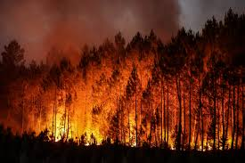

<h1 align="center">Wildfire Detection Using CNN and Grad-CAM</h1>

This project implements a Convolutional Neural Network (CNN) to classify real-world RGB images as either *fire* or *non-fire*. Using a custom image dataset, the model achieves over 95% accuracy and incorporates **Grad-CAM** visualizations to interpret what the model "sees" when making predictions.

<p align="center">
  
</p>

---

## Dataset

- Source: [Kaggle Fire Dataset](https://www.kaggle.com/datasets/amerzishminha/forest-fire-and-non-fire-dataset)
- Structure:
  ```
  /train/
      /fire/
      /non_fire/
  /test/
      /fire/
      /non_fire/
  ```
- Total:
  - Training: 6,122 images
  - Testing: 15,609 images

---

## Model Architecture

A custom CNN built using the TensorFlow Keras Functional API:

- **Input:** 150x150 RGB images
- **Layers:**
  - 3× Conv2D + MaxPooling
  - Flatten → Dense → Dropout → Output
- **Output:** Sigmoid-activated binary classifier
- **Optimizer:** Adam (lr = 0.0001)
- **Loss:** Binary Crossentropy

```python
inputs = Input(shape=(150, 150, 3))
x = Conv2D(32, (3,3), activation='relu')(inputs)
x = MaxPooling2D(2,2)(x)
x = Conv2D(64, (3,3), activation='relu')(x)
x = MaxPooling2D(2,2)(x)
x = Conv2D(128, (3,3), activation='relu', name='last_conv')(x)
x = MaxPooling2D(2,2)(x)
x = Flatten()(x)
x = Dense(128, activation='relu')(x)
x = Dropout(0.5)(x)
outputs = Dense(1, activation='sigmoid', name='dense_7')(x)
model = Model(inputs=inputs, outputs=outputs)
```

---

## Training

- **Epochs:** 10
- **Batch Size:** 32
- **Callbacks:** EarlyStopping
- **Augmentation:** Rotation, Zoom, Flip (training set only)

Training & evaluation were performed using `ImageDataGenerator` with preprocessed image folders.

---

## Performance

| Metric           | Train Set | Test Set |
|------------------|-----------|----------|
| Accuracy         | 95.08%    | 95.00%   |
| Loss             | 0.1336    | 0.1400   |

Model performance was evaluated on a large and diverse test set of over 15,000 images, ensuring high confidence in its generalization ability.

---

## Model Interpretability: Grad-CAM

**Grad-CAM** was used to generate heatmaps showing where the model focused when making its prediction. This helps explain deep learning results, especially for high-risk applications like wildfire detection.

### Fire Image

| Original Image | Grad-CAM Overlay |
|----------------|------------------|
|  |  |

### Non-Fire Image

| Original Image | Grad-CAM Overlay |
|----------------|------------------|
|  |  |

---

## Folder Structure

```
wildfire_detection/
├── train/
├── test/
├── wildfire_detection_cnn.ipynb
├── images/
│   ├── metrics_plot.png
│   ├── original.png
│   └── gradcam.png
└── README.md
```

---

## Technologies Used

- Python 3
- TensorFlow 2 (with Keras API)
- OpenCV (for Grad-CAM overlay)
- Matplotlib (for visualizations)
- Google Colab (development environment)

---

## Key Takeaways

- Built and evaluated a CNN from scratch using real wildfire images.
- Achieved 95% test accuracy with minimal overfitting.
- Used Grad-CAM to visualize and explain predictions.
- Demonstrated potential of AI in climate-tech and disaster response applications.

---

## Conclusion

This project demonstrates the practical application of deep learning in wildfire detection using RGB imagery. By training a Convolutional Neural Network (CNN) on a large dataset and incorporating Grad-CAM visualizations, the model not only achieves high classification accuracy but also provides interpretability, which is a crucial aspect in high-stakes scenarios such as natural disaster monitoring.

The workflow, from data preprocessing and augmentation to model evaluation and explanation, showcases a complete pipeline for computer vision-based binary classification. Future improvements could include deploying the model in real-time systems, expanding to multispectral data, or integrating it with geospatial platforms for early warning systems.

